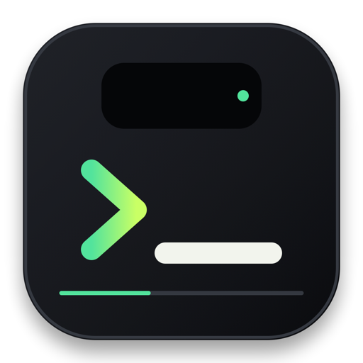
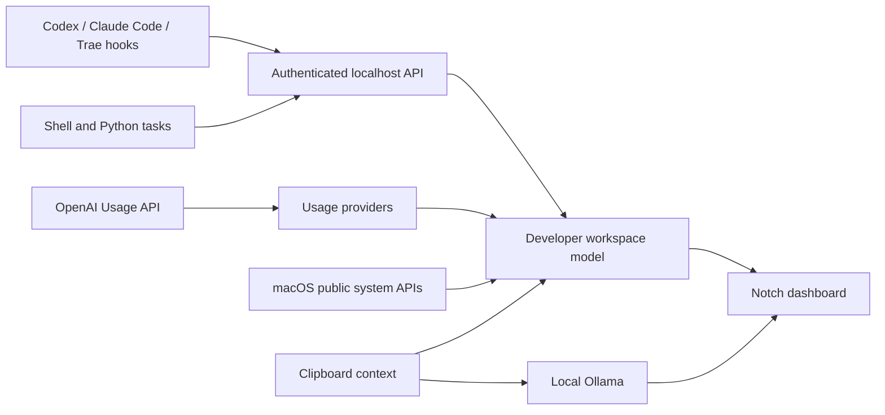

<div align="center">



# DevNotch

**A native macOS workspace for AI usage, local agents, builds, logs, and system status.**

**面向开发者的 macOS AI 灵动岛：在顶部统一查看 Token、Agent、构建、日志与本地模型状态。**

Development preview. No signed release is available yet.

</div>

DevNotch turns the area around the MacBook notch, or the center of the menu bar on other displays, into a compact developer console. It adds verified AI token telemetry, local Ollama actions, clipboard context, external task events, and system metrics to the mature window and interaction foundation from [Boring Notch](https://github.com/TheBoredTeam/boring.notch).

The project reports only data it can identify and verify. Missing credentials, undocumented provider formats, and unavailable hardware metrics remain visibly unavailable instead of becoming estimated values.

## Current capabilities

- Existing notch and non-notch window behavior inherited from Boring Notch.
- Developer dashboard with CPU, memory, network, battery, token totals, clipboard context, and task state.
- OpenAI organization Usage API integration with Admin Key storage in macOS Keychain.
- Clear separation between OpenAI API organization usage and Codex subscription quota.
- Clipboard classification for source code, errors, Git diffs, English, general text, and common credential formats.
- Cancellable, streaming local AI actions through Ollama.
- Ollama and vLLM model endpoint health checks.
- Authenticated `127.0.0.1` API for builds, tasks, logs, and client-reported token events.
- Explicit integration states for Codex, Claude Code, and Trae.

See [Implementation Status](docs/IMPLEMENTATION_STATUS.md) for what has been verified, what still requires full Xcode, and which providers need an authoritative data source.

## Developer dashboard

The open notch contains three dense work surfaces:

| System | AI usage | Context |
| --- | --- | --- |
| CPU, memory, network, battery | Input, cached input, output, provider health | Clipboard actions, Agent tasks, build state |

AI results open in a separate popover so long responses do not resize or destabilize the notch.

## Product boundary

| Project | Primary focus | DevNotch relationship |
| --- | --- | --- |
| [Boring Notch](https://github.com/TheBoredTeam/boring.notch) | Media, calendar, shelf, HUDs, and general notch utilities | The GPL-3.0 foundation used by this project |
| [Atoll](https://github.com/Ebullioscopic/Atoll) | General notch utilities, system insight, extensions, and LLM usage tracking | Adjacent project with overlapping telemetry workflows |
| **DevNotch** | Source-labeled token telemetry, authenticated automation events, and local Ollama clipboard actions | Optimized for measurable developer and local-AI workflows |

DevNotch does not claim exclusivity. Its design constraint is stricter: a usage number must retain its provider, collection source, and confidence level, and unavailable data must remain visibly unavailable.

## Preview

Integrated application screenshots and an interaction recording will be added after the full Xcode build and runtime QA gate passes. The repository does not use generated UI screenshots as release evidence.

## Data flow



## Build from source

The selected upstream baseline currently requires:

- macOS 14 Sonoma or newer
- Xcode 16.4 or newer
- Apple Silicon or Intel Mac

```sh
git clone https://github.com/DevNotch/DevNotch.git
cd DevNotch
swift build
swift test
open boringNotch.xcodeproj
```

Open the project, select the `boringNotch` scheme, and run the application. The application and XPC service use DevNotch bundle identifiers; internal target names remain inherited until a full Xcode signing migration can be verified.

Homebrew installation and manual release downloads are planned only after a signed release pipeline exists. There is currently no valid DevNotch install command or downloadable binary.

## Configure Ollama

Install and start Ollama separately, then ensure at least one coding model is available:

```sh
ollama list
ollama pull qwen2.5-coder:7b
```

In **Settings > Developer**, configure the endpoint and model. The default endpoint is `http://127.0.0.1:11434`. DevNotch checks `/api/tags` and reports the actual connection error when Ollama is unavailable.

Clipboard text is sent only after the user selects an action. Common private-key, API-key, GitHub-token, and JWT patterns block AI actions. Generated text is displayed but never executed.

## AI usage providers

| Provider | Source | Status |
| --- | --- | --- |
| OpenAI API | Official organization Usage API | Implemented; requires an Admin Key |
| Codex local sessions | Local structured `token_count` events | Adapter implemented; not subscription quota |
| Codex Cloud | No verified remote usage or quota interface configured | Unavailable by design |
| Claude Code | Official status-line input | Adapter implemented |
| Trae | Usage is visible in the IDE/account, but no official export API or hook is documented | Local event submission available |
| Other clients | `POST /v1/usage/events` | Implemented |

OpenAI credentials are stored in Keychain. DevNotch does not calculate cost from a hard-coded pricing table and does not label API usage as Codex subscription usage.

To report local Codex session totals without exposing prompts or responses:

```sh
export DEVNOTCH_API_TOKEN='value-copied-from-keychain'
python3 Examples/codex_usage_sync.py --watch 30
```

This adapter reads the current local Codex JSONL structure. It fails with a concrete parsing error if that undocumented structure changes. It cannot see cloud tasks that have not been synchronized to the local client.

TRAE documents per-session and account-profile usage in its product UI, but not a supported export API or hook. DevNotch therefore does not scrape authenticated pages or reverse-engineer private traffic. See [TRAE's official usage description](https://www.trae.ai/blog/trae_update_0902?v=1).

## Local developer API

Enable the server in **Settings > Developer**, copy the generated access token, and export it only to the process that needs it:

```sh
export DEVNOTCH_API_TOKEN='value-copied-from-keychain'
scripts/devnotch-event build "Compile DevNotch" --state running --progress 0.4
scripts/devnotch-event task "Run tests" --state succeeded --progress 1
```

Submit client-reported token usage:

```sh
scripts/devnotch-event usage \
  --provider claude-code \
  --input 4200 \
  --cached-input 1800 \
  --output 720 \
  --model claude-sonnet \
  --timestamp 2026-09-04T12:00:00Z
```

The server requires Bearer authentication, accepts strict JSON objects, limits request size and rate, and never executes submitted commands. Read the complete [Local API documentation](docs/LOCAL_API.md).

## Privacy and security

- Provider credentials and the local API token are stored in macOS Keychain.
- Clipboard contents are not persisted as history.
- Local events are retained in memory with bounded history.
- The event listener binds only to `127.0.0.1`.
- Unknown request fields and invalid numeric ranges are rejected.
- Unsupported providers display a reason instead of synthetic usage.

Report vulnerabilities privately according to [SECURITY.md](SECURITY.md).

## Architecture

DevNotch is integrated as a filesystem-synchronized feature directory inside the inherited application target:

```text
boringNotch/DevNotch/
├── DeveloperWorkspaceModel.swift
├── Features/
│   ├── AIAction.swift
│   ├── ClipboardClassifier.swift
│   ├── ClipboardMonitor.swift
│   ├── DeveloperDashboardView.swift
│   └── DeveloperSettingsView.swift
├── Models/
└── Services/
```

`Package.swift` exposes the non-UI core separately so CI can build and test parsing, aggregation, Ollama streaming, Keychain access, monitoring, and local API behavior without loading the complete application.

## Community

The planned DevNotch GitHub Organization will host the application, integration documentation, Discussions, and future adapters that contain real maintained code. Empty SDK or plugin repositories will not be created for appearance.

- Use Discussions for questions, ideas, and integration proposals.
- Use the integration issue form for a new provider data source.
- Read [CONTRIBUTING.md](CONTRIBUTING.md), [GOVERNANCE.md](GOVERNANCE.md), and [SUPPORT.md](SUPPORT.md).

## Attribution and license

DevNotch is a derivative of [TheBoredTeam/boring.notch](https://github.com/TheBoredTeam/boring.notch). The upstream project and this derivative are distributed under the [GNU General Public License v3.0](LICENSE). Existing copyright notices, contributor history, and third-party attributions are retained.

See [THIRD_PARTY_LICENSES](THIRD_PARTY_LICENSES) for inherited dependency notices.
